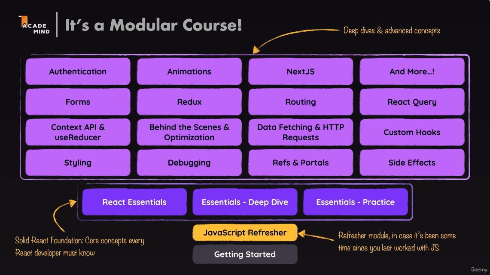

# Getting Started
## Vanilla js vs React
- [Vanilla JS Demo](https://codesandbox.io/p/sandbox/vanilla-js-demo-6049kj?file=%2Findex.js)
- [React Demo](https://codesandbox.io/p/sandbox/react-vs-vanilla-demo-uc08fv)

## The index of the course

## Github Course snapshots

[Link to repo](https://github.com/academind/react-complete-guide-course-resources)

## New React (project sandbox)

[react.new](https://react.new)

## New React Project (local)
- Vite (npm create vite@latest react-project, npm run dev)
- Create React App

For Zip files of the course use:
- npm install
- npm run dev